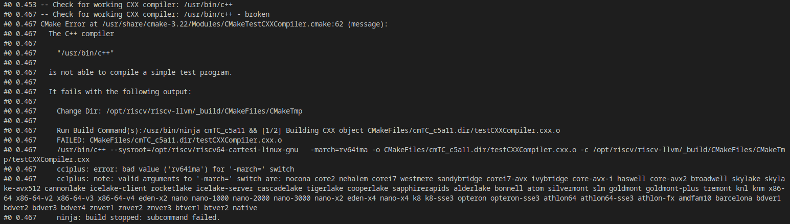
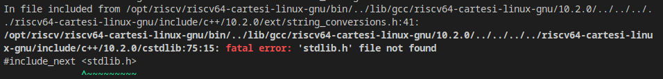
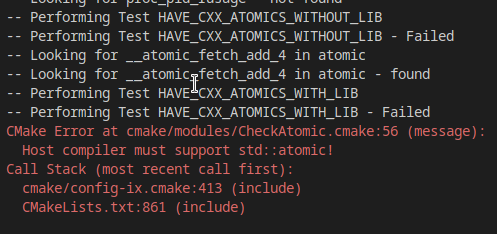

# Godot Toolchain for Cartesi

This project aims to build the Godot Engine for the Cartesi Machine to enable a new wave of blockchain integrated games.

## Motivation

Currently, blockchain integrated games follow two main patterns:

 - Web 2.5, where digital assets are stored onchain but all other game logic is built offchain either in the game client that players run or on game servers managed by the development team. This works well for most games but is very limited in how it can leverage the blockchain.
 - Fully onchain, where all the game logic is built with smart contracts and the offchain components are almost exclusively presentation layers. This comes with the serious restriction to computation in the form of gas usage, and requires game developers to build with unfamiliar tools not well suited to game development.

[ Godot ]( https://github.com/godotengine/godot ) is an open source, cross platform game engine that has the potential to bridge this gap, allowing developers to build game logic with familiar tools, then run it in a secure, decentralized manner with a tight integration to the blockchain. It also already has [ experimental support for the RISC-V architecture ]( https://github.com/godotengine/godot-proposals/issues/3374 ) so in theory it should be able to run on Cartesi with limited effort.

## Challenges

The primary challenge with building Godot for Cartesi is in its compiler support. Godot can only be compiled for RISC-V with Clang due to [a bug in gcc with atomics](https://github.com/riscv-collab/riscv-gcc/issues/15). 

